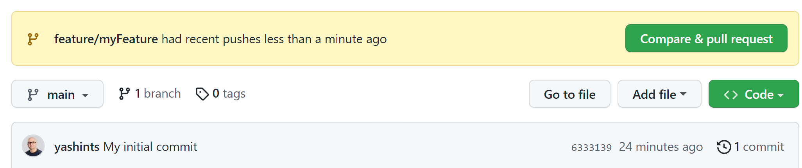

# Git branching strategy

In this demo, you will show the concept of feature branching and pull requests.

## Before the class

Make sure you have the tools mentioned in `Module 2 - Git Demo` installed.

## During the class

Open the `run.azcli` file and start running the commands. When you reached the command to open `program.cs`, paste the following two lines under the first line.

```cs
builder.Logging.ClearProviders();
builder.Logging.AddConsole();
```

Then continue the commands and when the changes was pushed to GitHub, open a browser and create a PR, show the process and merge it.


