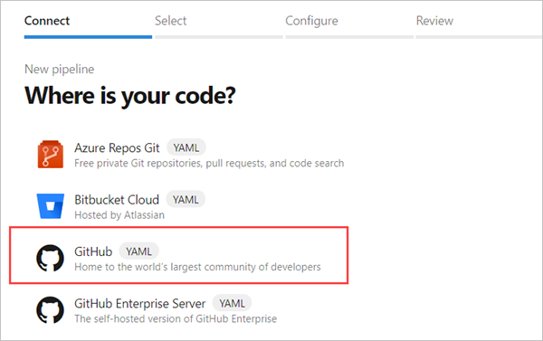

# Create a multi-platform pipeline

This demo creates a pipeline which runs on multiple platforms.

## Prerequisites

Make sure you have the following items:

- A GitHub account where you can create a repository. [Create one for free](https://github.com).

- An Azure DevOps organization. [Create one for free](https://azure.microsoft.com/en-gb/products/devops/pipelines/).
  If your team already has one, then make sure you're an administrator of the Azure DevOps project that you want to use.

- An ability to run pipelines on Microsoft-hosted agents. To use Microsoft-hosted agents, your Azure DevOps organization must have access to Microsoft-hosted parallel jobs. You can either purchase a parallel job or you can request a free grant.

## Get the sample code

You can use Azure Pipelines to build an app on written in any language, on multiple platforms at the same time.

1. Go to [https://github.com/Azure-Samples/js-e2e-express-server](https://github.com/Azure-Samples/js-e2e-express-server).

1. Fork the repo into your own GitHub account.

You should now have a sample app in your GitHub account.

## Add a pipeline

In the sample repo, there's no pipeline yet.
You're going to add jobs that run on three platforms.

1. Go to your fork of the sample code on GitHub.

1. Choose 'Create new file'. Name the file `azure-pipelines.yml`, and give it the contents below.

```yaml
# Build NodeJS Express app using Azure Pipelines
# https://learn.microsoft.com/azure/devops/pipelines/ecosystems/javascript?view=azure-devops
strategy:
  matrix:
    linux:
      imageName: "ubuntu-latest"
    mac:
      imageName: "macOS-latest"
    windows:
      imageName: "windows-latest"

pool:
  vmImage: $(imageName)

steps:
  - task: NodeTool@0
    inputs:
      versionSpec: "8.x"

  - script: |
      npm install
      npm test

  - task: PublishTestResults@2
    inputs:
      testResultsFiles: "**/TEST-RESULTS.xml"
      testRunTitle: "Test results for JavaScript"

  - task: PublishCodeCoverageResults@1
    inputs:
      codeCoverageTool: Cobertura
      summaryFileLocation: "$(System.DefaultWorkingDirectory)/**/*coverage.xml"
      reportDirectory: "$(System.DefaultWorkingDirectory)/**/coverage"

  - task: ArchiveFiles@2
    inputs:
      rootFolderOrFile: "$(System.DefaultWorkingDirectory)"
      includeRootFolder: false

  - task: PublishBuildArtifacts@1
```

At the bottom of the GitHub editor, select **Commit changes**.

Each job in this example runs on a different VM image.
By default, the jobs run at the same time in parallel.

Note: `script` runs in each platform's native script interpreter: Bash on macOS and Linux, CMD on Windows.
See [multi-platform scripts](https://learn.microsoft.com/en-us/azure/devops/pipelines/scripts/cross-platform-scripting?view=azure-devops&tabs=yaml) to learn more.

## Create the pipeline

Now that you've configured your GitHub repo with a pipeline, you're ready to build it.

1. Sign in to your Azure DevOps organization and navigate to your project.

1. In your project, go to the **Pipelines** page, and then select **New pipeline**.

1. Select **GitHub** as the location of your source code.

   

1. For **Repository**, select **Authorize** and then **Authorize with OAuth**.

1. You might be redirected to GitHub to sign in. If this happens, then enter your GitHub credentials. After you're redirected back to Azure Pipelines, select the **sample app** repository.

1. For the **Template**, Azure Pipelines analyses the code in your repository. If your repository already contains an `azure-pipelines.yml` file (as in this case), then this step is skipped. Otherwise, Azure Pipelines recommends a starter template based on the code in your repository.

1. Azure Pipelines shows you the YAML file that it will use to create your pipeline.

1. Select **Save and run**, and then select the option to **Commit directly to the main branch**.

1. The YAML file is pushed to your GitHub repository, and a new build is automatically started. Wait for the build to finish.
