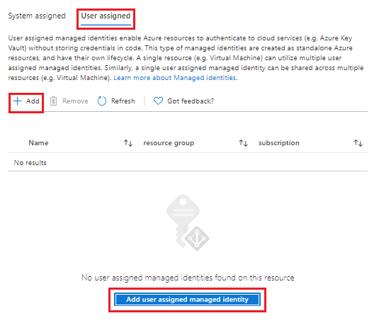
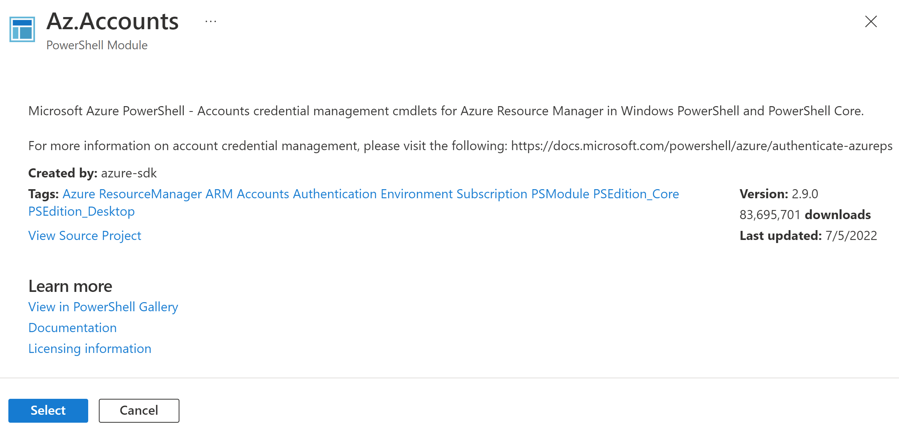
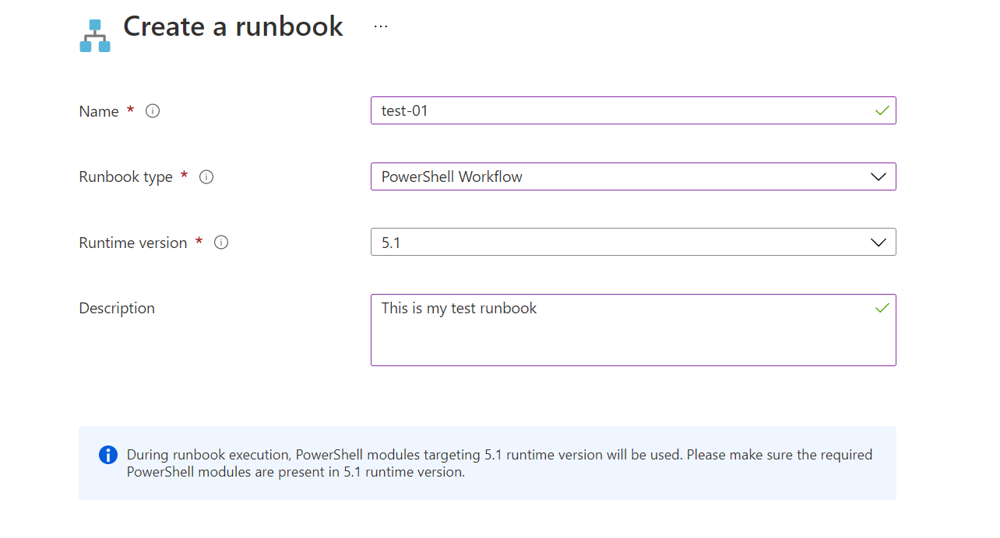
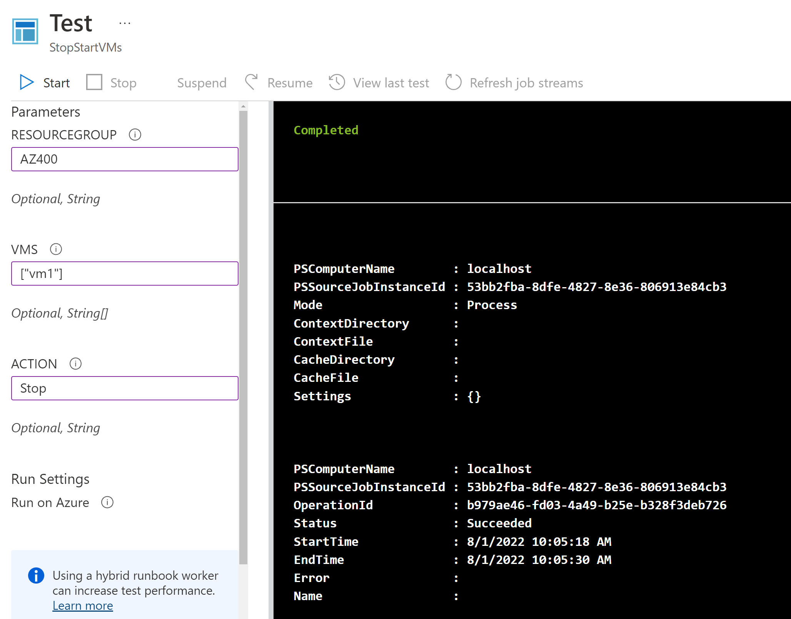

# Azure Automation Runbook demo

This demo helps to show learners how to use an automation account to manage resources and create workflows.

## Prerequisites

You need an Azure Subscription and Azure CLL installed.

## Before the class

Run the commands within the `prep.azcli`, then navigate to your Azure portal and assign the user assigned managed identity you created to your automation account:



You also need to add the `Az.Accounts` and `Az.Compute` modules to your account:



You can use the instruction in the [Azure documentation here](https://docs.microsoft.com/en-us/azure/automation/shared-resources/modules#import-az-modules).

Once done, create two role assignment for the VMs and assign the `DevTest Labs User` to the user assigned managed identity.

Next you need to create a runbook, navigate to the runbook's page and and select the **Create a runbook** button. Fill up the details and select **PowerShell Workflow** for your runbook with the same runtime version you used to add those modules earlier.



Next add the below snippet to your runbook:

```ps
workflow MyFirstRunbook-Workflow
{
Param(
    [string]$resourceGroup,
    [string[]]$VMs,
    [string]$action
)

# Ensures you do not inherit an AzContext in your runbook
Disable-AzContextAutosave -Scope Process

# Connect to Azure with system-assigned managed identity
$AzureContext = (Connect-AzAccount -Identity -AccountId <ClientId>).context

# set and store context
$AzureContext = Set-AzContext -SubscriptionName $AzureContext.Subscription -DefaultProfile $AzureContext

# Start or stop VMs in parallel
if($action -eq "Start")
    {
        ForEach -Parallel ($vm in $VMs)
        {
            Start-AzVM -Name $vm -ResourceGroupName $resourceGroup -DefaultProfile $AzureContext
        }
    }
elseif ($action -eq "Stop")
    {
        ForEach -Parallel ($vm in $VMs)
        {
            Stop-AzVM -Name $vm -ResourceGroupName $resourceGroup -DefaultProfile $AzureContext -Force
        }
    }
else {
	    Write-Output "`r`n Action not allowed. Please enter 'stop' or 'start'."
	}
}
```

Replace the `<Client Id>` with the app id of the user assigned managed identity, then select **Save**. You can test it by using the **Test** button, pass in the resource group name, the name of the two VMs and the action you want to perform (i.e. Stop).

Feel free to show the publishing process too.


