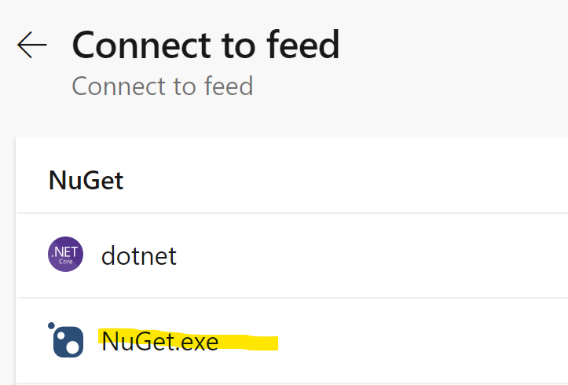
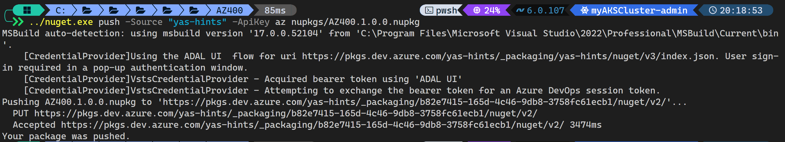

# Azure Artifacts demo

In this section you will demonstrate Azure Artifacts and how to publish a package into it.

## Before class

Create an Azure DevOps project, create a feed. You will also need to have:

- Dotnet CLI
- Azure CLI

installed on your system.

## During the class

Open the `run.azcli` in a PowerShell terminal. Run the commands to create a new class library, go into the directory.

Delete the `Class1.cs` file and copy the `Calculator.cs` into the `AZ400` folder.

Now run the `dotnet pack` command to create the **Nuget** package.

Next go to your feed in Azure DevOps and select connect to feed:


Select _Nuget.exe_ from the list:



Now create a file named `nuget.config` inside your `AZ400` directory and copy the entire configuration section (do not use the copy button) in that file. The file's content should look like:

```xml
<?xml version="1.0" encoding="utf-8"?>
<configuration>
  <packageSources>
    <clear />
    <add key="yas-hints" value="https://pkgs.dev.azure.com/yas-hints/_packaging/yas-hints/nuget/v3/index.json" />
  </packageSources>
</configuration>
```

Now you're ready to run the last command, simply replace the name of the source with your source and execute the command:

```bash
../nuget.exe push -Source "AZ400Pkg" -ApiKey az nupkgs/AZ400.1.0.0.nupkg
```



Now go back to your feed and refresh the page, and voila.


