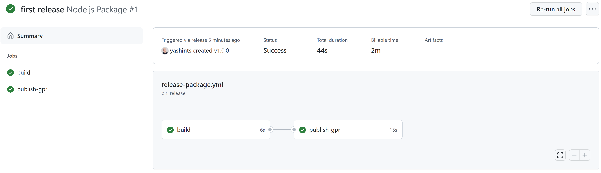
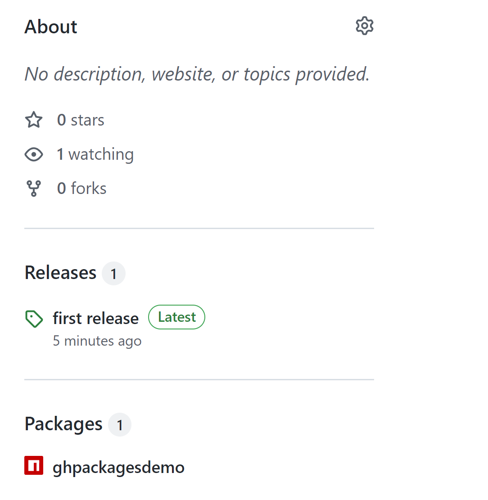

# GitHub packages demo

This demo shows how to publish packages to GitHub packages from a GitHub Action workflow.

## Prerequisites

Have a GitHub account handy.

## Before the class

Run the commands in the `run.azcli` script in a PowerShell terminal. When prompted after the `npm init` command, enter the values as follows and leave the rest with default values:

```bash
...
package name: @YOUR-USERNAME/YOUR-REPOSITORY
...
test command: exit 0
```

## During the class

Edit the `package.json` and add the following to and add your username:

```json
"publishConfig": {
   "@YOUR-USERNAME:registry": "https://npm.pkg.github.com"
 }
```

Commit and push the changes to your repository, then navigate to the code tab and create a new release with tag `v.1.0.0`.



Show the learners how the action is now running and will publish an `npm` package which can be used by anyone.


